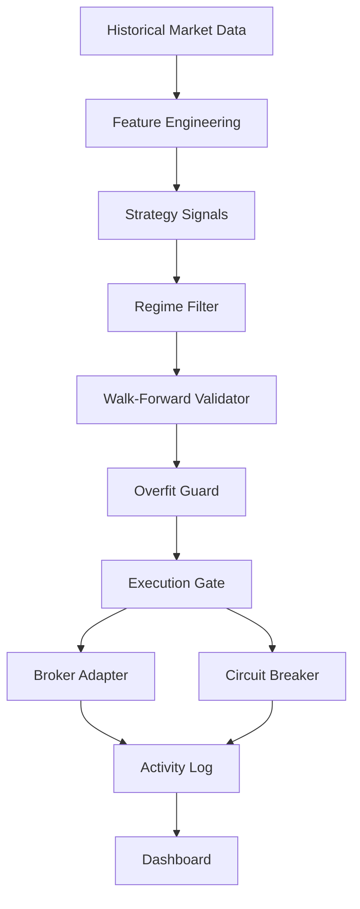

# Trading Research Monorepo

**Algorithmic trading research, walk-forward validation, execution controls, and market UI experiments**

[](bot)
[](docs/RISK_DISCLOSURE.md)
[](.github/workflows/ci.yml)

This repository contains two related systems:

- `bot/`: Binance demo futures trading bot, strategy gates, walk-forward validation, dashboard, circuit breaker, and tests.
- `flowsurface/`: Rust market interface and visualization experiment.

## Important Risk Disclosure

This repository is for research and engineering demonstration. It is not financial advice. Automated trading can lose money quickly, especially with leverage, latency, market gaps, liquidation risk, exchange outages, API failures, and overfit models. Use paper trading and small controlled experiments before any live deployment.

Read: [`docs/RISK_DISCLOSURE.md`](docs/RISK_DISCLOSURE.md)

## Why This Project Matters

Trading repos often show only a strategy script. This repository is stronger because it includes:

- walk-forward validation,
- overfit guards,
- circuit breakers,
- multi-bot execution gates,
- tests for strategy behavior,
- dashboard payload tests,
- VPS deployment assets,
- separation between research, execution, and monitoring.

## Quickstart

```bash
cd bot
python -m pip install -r requirements.txt
pytest -q
python dashboard_multi.py
python multi_bot.py
```

## Validation

Current local validation:

```bash
PYTHONPATH=bot pytest -q bot
```

Expected: 26 tests passing.

## Architecture



## Research Standards

- No live capital without paper-trading validation.
- No strategy deployment without out-of-sample tests.
- No model promotion without walk-forward evidence.
- No execution without circuit breakers.
- No secrets committed to git.
- No performance claim without fees, slippage, and drawdown.

## Documentation

- [Risk disclosure](docs/RISK_DISCLOSURE.md)
- [Backtesting protocol](docs/BACKTESTING_PROTOCOL.md)
- [Model governance](docs/MODEL_GOVERNANCE.md)
- [VPS deployment](deploy/vps/README.md)

## Local Components

### Bot

```bash
cd bot
python -m pip install -r requirements.txt
python dashboard_multi.py
python multi_bot.py
```

### Flowsurface

```bash
cd flowsurface
cargo run --release
```

## Author

Diego F. Pulido Sastoque
